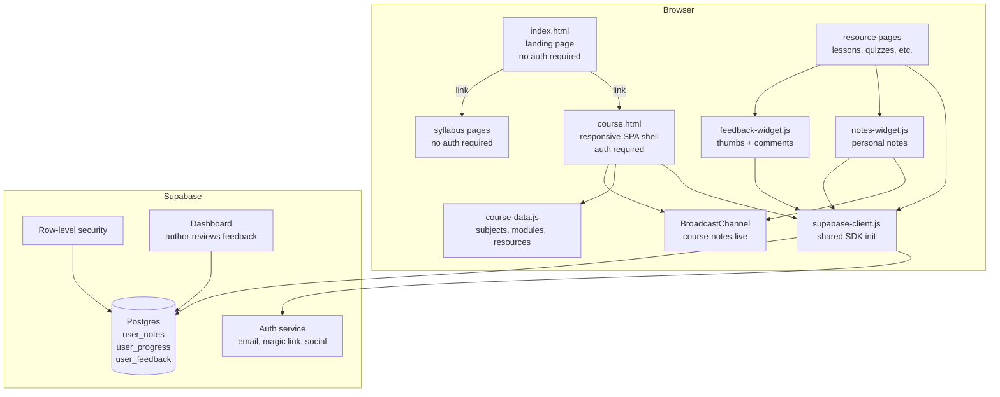
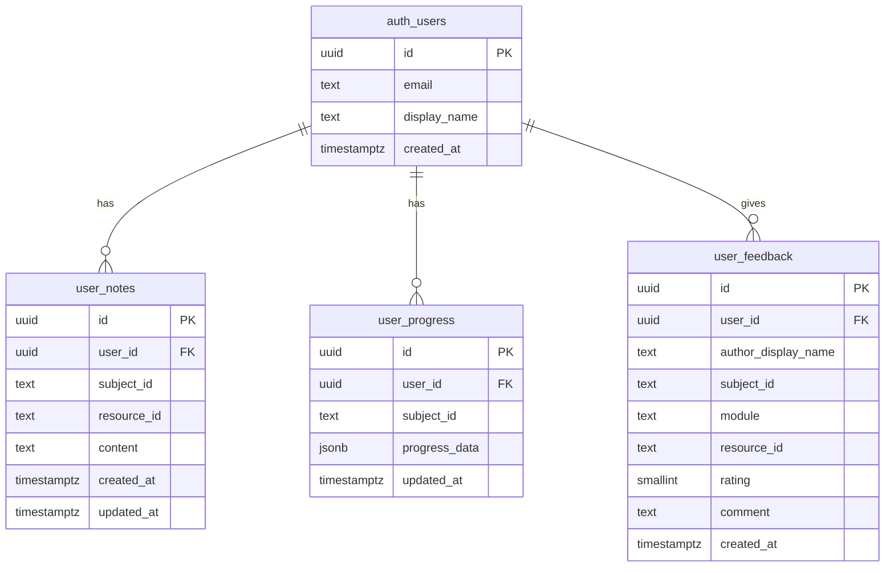

# Design Package: User Identity, Data Persistence, and Learner Feedback

**Date:** 2026-04-05
**Status:** Revised draft — awaiting approval
**GPSR Reference:** [gpsr-iam-persistence-feedback.md](../analysis/gpsr-iam-persistence-feedback.md)

---

## 1. Component Diagram



### Component Responsibilities

| Component | Responsibility |
|-----------|---------------|
| `supabase-client.js` | Initialize Supabase SDK, expose auth and database client to all other components. Single source of Supabase config (URL, anon key). |
| `course.html` | SPA shell. Auth gate — redirects to login if no session. Renders modules/resources from `course-data.js`. Reads/writes progress via `supabase-client.js`. Renders module-overview notes as grouped read-only notes. Listens for `BroadcastChannel` note-save events and refreshes visible note views in the same browser session. Responsive layout for desktop and mobile. |
| `notes-widget.js` | Self-injecting IIFE on resource pages. Reads/writes notes to Supabase via `supabase-client.js`. Resource pages are the only note editor. After a successful save/delete, publishes a small `BroadcastChannel` message so other open tabs in the same browser session can refresh. One note per user per resource. |
| `feedback-widget.js` | Self-injecting IIFE on all module and resource pages. Thumbs up/down + optional comment. Writes to Supabase with auto-captured context. Append-only. |
| `course-data.js` | Static course structure. Source of truth for subject slugs, module numbers, and resource IDs. No changes to its role — just adds `id` fields to resources. |
| Browser `BroadcastChannel` | Same-browser, same-profile event bus used only for note-refresh hints after successful saves. Not a source of truth and not a persistence layer. |
| Supabase Auth | Manages user identity. Three methods: email+password, magic link, social (Google, GitHub). Long-lived session. |
| Supabase Postgres | Stores user_notes, user_progress, user_feedback. RLS enforces per-user isolation. |
| Supabase Dashboard | Author's admin view. No custom UI built — author queries tables directly. |

---

## 2. Interface Definitions

### supabase-client.js

Loaded via CDN `<script>` tag before any component that needs it.

```
Exposes:
  window.supabaseClient    — initialized Supabase client instance
  window.supabaseReady     — Promise that resolves when client + session are ready

Depends on:
  Supabase JS SDK (loaded via CDN <script> before this file)
  Config: SUPABASE_URL, SUPABASE_ANON_KEY (embedded in file)
```

**Auth contract:**
- On load, checks for existing session
- If session exists → resolves `supabaseReady` with user object
- If no session → page-level code decides behavior (course.html redirects to login; resource pages degrade gracefully)

### course.html auth gate

```
Preconditions:
  - supabase-client.js loaded
  - supabaseReady resolved

Behavior:
  - If authenticated → render course content, load progress from Supabase
  - If not authenticated → show login UI (inline, not a separate page)
  - On successful login → store session (Supabase handles cookie), render content
  - On logout → clear session, return to login UI

No-auth pages (accessible without login):
  - index.html (landing page / subject listing)
  - docs/syllabus/* (syllabus pages for all subjects)

Login UI offers:
  - Email + password (with sign-up flow)
  - Magic link
  - Google OAuth
  - GitHub OAuth
```

### notes-widget.js

```
Preconditions:
  - supabase-client.js loaded on the page
  - Page includes data attributes: data-subject-id, data-resource-id

Reads:
  SELECT content FROM user_notes
  WHERE user_id = auth.uid()
    AND subject_id = :subject_id
    AND resource_id = :resource_id

Writes (upsert on save, debounced 600ms):
  UPSERT INTO user_notes (user_id, subject_id, resource_id, content, updated_at)
  ON CONFLICT (user_id, subject_id, resource_id)

Deletes:
  If content is cleared, DELETE the row.

Live refresh hint:
  After a successful save or delete, publish a BroadcastChannel message:
  {
    type: "note-saved",
    subjectId,
    resourceId,
    content
  }

Failure behavior:
  If supabaseReady fails, the learner is signed out, or the network is
  unavailable, show an explicit status and do not silently fall back to
  note-related localStorage persistence.
```

### BroadcastChannel live note refresh

```
Channel name:
  "course-notes-live"

Sender:
  notes-widget.js on successful note save or delete

Receiver:
  course.html while loaded in the same browser profile

Receiver behavior:
  - Ignore messages for other subjects
  - Reload note rows from Supabase rather than trusting the message payload as
    the source of truth
  - Rerender the currently visible module-overview notes surface if it is open
  - Leave behavior unchanged if BroadcastChannel is unsupported

Scope boundary:
  - Same browser profile on the same device only
  - No cross-browser or cross-device live sync
  - Does not replace Supabase persistence
```

### feedback-widget.js

```
Preconditions:
  - supabase-client.js loaded on the page
  - Page includes data attributes: data-subject-id, data-module, data-resource-id

Writes (on thumb click + optional comment submit):
  INSERT INTO user_feedback (
    user_id, author_display_name, subject_id, module,
    resource_id, rating, comment, created_at
  )

  rating: 1 (thumbs up) or -1 (thumbs down)
  comment: nullable text, submitted only if user types something
  author_display_name: from Supabase auth user metadata
  created_at: timestamptz, set by database default

No reads, no updates, no deletes — append-only from the learner's perspective.
Author reads via Supabase dashboard.
```

### course.html progress

```
Preconditions:
  - User authenticated
  - supabase-client.js loaded

Reads (on page load):
  SELECT progress_data FROM user_progress
  WHERE user_id = auth.uid()
    AND subject_id = :subject_id

Writes (on checkbox toggle):
  UPSERT INTO user_progress (user_id, subject_id, progress_data, updated_at)
  ON CONFLICT (user_id, subject_id)

progress_data structure (unchanged from current localStorage format):
  { "m1": true, "m2": false, "r1-0": true, "r1-1": false, ... }
```

### Data attributes contract

Every resource page must include these attributes (on `<body>` or a root element) so widgets can auto-capture context:

```html
<body data-subject-id="claude-code"
      data-module="1"
      data-resource-id="m1-lesson">
```

These are derived from `course-data.js` and set when generating or authoring pages.

---

## 3. Database Schema

### ERD



### Constraints

| Table | Unique constraint |
|-------|-------------------|
| user_notes | `(user_id, subject_id, resource_id)` |
| user_progress | `(user_id, subject_id)` |
| user_feedback | none (append-only) |

### Row-Level Security

| Table | SELECT | INSERT | UPDATE | DELETE |
|-------|--------|--------|--------|--------|
| user_notes | `user_id = auth.uid()` | `user_id = auth.uid()` | `user_id = auth.uid()` | `user_id = auth.uid()` |
| user_progress | `user_id = auth.uid()` | `user_id = auth.uid()` | `user_id = auth.uid()` | denied |
| user_feedback | `user_id = auth.uid()` | `user_id = auth.uid()` | denied | denied |

---

## 4. ADRs

### ADR-002: Supabase as auth + data platform

**Context:** The course platform needs user identity and persistent data storage. It is currently 100% static files with no backend. Budget is near-zero. Scale target is < 50 learners.

**Decision:** Adopt Supabase (free tier) for authentication and Postgres data storage. Load the JS SDK via CDN to avoid introducing build tools.

**Consequences:**
- (+) Auth, database, RLS, and admin dashboard in one service — no integration overhead
- (+) Free tier covers 50,000 MAU — well beyond our needs
- (+) Open-source and self-hostable — exit path exists
- (+) No server to maintain — client-side SDK only
- (-) First external dependency in the project
- (-) Supabase anon key is public in client JS — security depends entirely on RLS being correct
- (-) Adds ~40KB SDK payload to page loads

### ADR-003: Stable resource IDs in course-data.js

**Context:** The database stores references to subjects and resources. File paths change when content is renamed or reorganized. Using paths as foreign keys would cause data orphaning on rename.

**Decision:** Add a stable `id` field to each resource in `course-data.js`. Use `slug` (already present) for subjects and the new `id` for resources as the database keys. The JS resolves IDs to file paths at runtime.

**Consequences:**
- (+) Renaming or moving files doesn't break user data
- (+) IDs live in the same file as the rest of the course structure — single source of truth
- (-) Authors must remember to set an ID when adding a new resource
- (-) IDs must never be reused across different resources

### ADR-004: BroadcastChannel before Supabase Realtime

**Context:** After simplifying notes to use Supabase as the only persistent store and limiting editing to resource pages, the remaining UX gap is that an already-open module overview does not reflect a successful note save from another tab until the learner refreshes manually.

**Decision:** Add a same-browser `BroadcastChannel` hint so resource-page saves can prompt the already-open course shell to reload notes from Supabase and rerender the visible overview. Do not add Supabase Realtime at this stage.

**Consequences:**
- (+) Small client-only enhancement with no schema or backend subscription work
- (+) Preserves the clean architectural boundary: Supabase persists, BroadcastChannel refreshes
- (+) Solves the concrete annoyance the current learner flow exposes
- (-) Only works within the same browser profile on the same device
- (-) If future usage requires cross-device live updates, a separate follow-on decision about Supabase Realtime will still be needed

### ADR-005: Single responsive shell, retire mobile

**Context:** Two separate course shells exist (course.html for desktop, course-mobile.html for mobile) with duplicated logic. The mobile shell lacks features present in the desktop version (notes, Gist sync). Every new feature (auth, persistence, feedback) would need to be implemented in both.

**Decision:** Make course.html responsive via CSS media queries. Retire course-mobile.html. Update all links that reference it.

**Consequences:**
- (+) New features only implemented once
- (+) All users get the same functionality regardless of device
- (+) Eliminates code drift between shells
- (-) Must verify layout works on small viewports before removing mobile shell
- (-) Responsive CSS adds some complexity to course.html styles

### ADR-006: Feedback widget is append-only, author reviews via Supabase dashboard

**Context:** The author needs to see learner feedback (thumbs + comments) but expects low volume (~3 comments/week). Building a custom admin UI would violate the calibrated investment constraint (P6).

**Decision:** Feedback rows are append-only (no edit, no delete by learners). The author reviews feedback by querying the `user_feedback` table in the Supabase dashboard. No custom admin pages.

**Consequences:**
- (+) Zero custom admin code to build or maintain
- (+) Supabase dashboard supports filtering, sorting, export
- (-) Author must use Supabase dashboard (not the course itself) to see feedback
- (-) If volume grows significantly, a custom view may become necessary

---

## 5. Technology Choices

| Choice | What | Why | Tradeoff |
|--------|------|-----|----------|
| Supabase | Auth + Postgres + dashboard | All-in-one, free tier, open-source exit | First external dependency; security depends on RLS |
| CDN script tag | SDK loading method | No build tools, consistent with current architecture | Can't tree-shake unused SDK code (~40KB) |
| Vanilla JS | All new code | Consistent with existing codebase | No component framework benefits (acceptable at this scale) |
| CSS media queries | Responsive layout | Simplest responsive approach, no framework needed | Manual breakpoint tuning required |
| Data attributes on pages | Context passing to widgets | Declarative, no JS coupling between page and widget | Authors must include attributes on every page |

---

## 6. Traceability Matrix

| Design Component | GPSR Solution | GPSR Problem |
|------------------|---------------|--------------|
| supabase-client.js | S1 | P3 |
| Auth gate in course.html | S1 | P2, P3 |
| Login UI (email, magic link, social) | S1 | P2, P3 |
| user_notes table + notes-widget.js persistence | S1 | P1 |
| BroadcastChannel note refresh between notes-widget.js and course.html | S5 | P8 |
| user_progress table + course.html persistence | S1 | P1, P4 |
| user_feedback table + feedback-widget.js | S2 | P5 |
| Remove Gist code from course.html | S3 | P2, P4 |
| Responsive CSS in course.html | S4 | P7 |
| Retire course-mobile.html | S4 | P7 |
| Stable resource IDs in course-data.js | S1 (enabler) | — |
| Data attributes on resource pages | S1, S2 (enabler) | — |
| RLS policies | S1 (security) | — |

---

## 7. Implementation Order

Based on the dependency test in the GPSR defensibility report:

1. **S4: Responsive shell** — consolidate to single shell first
2. **Stable IDs** — add resource IDs to course-data.js, add data attributes to pages
3. **S1: Supabase setup** — project, schema, RLS, supabase-client.js, auth gate
4. **S1: Persistence** — notes and progress read/write via Supabase
5. **S5: BroadcastChannel live refresh** — same-browser note refresh between resource pages and the already-open course shell
6. **S3: Remove Gist** — strip all Gist code
7. **S2: Feedback widget** — replace current feedback-widget.js with thumbs up/down
