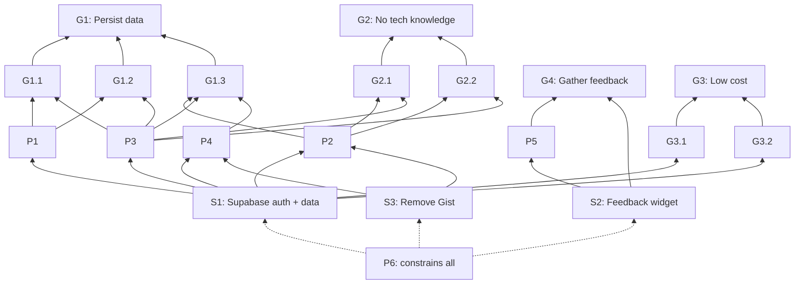

# GPSR Analysis: User Identity, Data Persistence, and Learner Feedback

**Date:** 2026-03-30
**Status:** Draft — awaiting approval
**Project classification:** (c) For others
**Scale target:** < 50 learners

---

## 1. Goal Hierarchy

```
G1: Learners' personalized data persists reliably across sessions, devices, and browsers
├── G1.1: Notes survive browser data loss and device changes
├── G1.2: Feedback survives browser data loss and device changes
└── G1.3: Progress/completion state survives browser data loss and device changes

G2: Setting up and using the course requires no technical knowledge
├── G2.1: No GitHub account or PAT required
└── G2.2: Sign-up/sign-in is a familiar, standard flow

G3: Operating costs stay low and proportional to actual usage
├── G3.1: No fixed infrastructure cost when nobody is using it
└── G3.2: Free or near-free at small scale (< 50 learners)

G4: Author can gather enough learner feedback to validate demand, without over-investing in tooling
```

**Priority order:** G1 > G2 > G3 > G4

---

## 2. Problem Map

| ID | Problem | Obstructs | Causal notes |
|----|---------|-----------|--------------|
| P1 | Notes and feedback are localStorage-only — clearing browser data, switching devices, or switching browsers loses all user-created content permanently | G1.1, G1.2 | Cannot be resolved without P3 solved first |
| P2 | Progress sync depends on GitHub Gist + Personal Access Token — requires technical knowledge to set up | G1.3, G2.1, G2.2 | Exists as a workaround because of P3 |
| P3 | No user identity system — no way to associate persisted data with a specific learner across devices | G1 (all), G2 (all) | Root blocker. P1 and P2 cannot be fully resolved without this |
| P4 | Gist sync has no error recovery or conflict resolution — sync failures may silently lose data | G1.3 | Goes away if Gist is replaced |
| P5 | No low-friction mechanism for learners to give feedback, and no easy way for the author to review it | G4 | |
| P6 | Investment must be calibrated — too little investment turns off early users before demand can be validated; too much is wasted if demand doesn't materialize | G1, G2, G3, G4 | Constrains the solution space globally |

**Causal relationships:**
- P3 AND P1 → conjunctive: even moving notes to a server doesn't help without identity to link them to a user
- P3 → P2: Gist/PAT exists *because* there is no proper identity system
- P4 is secondary: it goes away entirely when Gist is replaced

---

## 3. Solution Inventory

### S1: Adopt Supabase for auth + data storage

- **Classification:** Adopt/Configure
- **Resolves:** P1, P2, P3, P4
- **Advances:** G1 (all), G2 (all), G3 (all)
- **Description:**
    - Supabase provides auth, Postgres database, row-level security, and a built-in table dashboard — all in one free-tier service.
    - Auth methods: email+password, magic link, and social login (Google, GitHub).
    - Long-lived session cookie to minimize re-authentication (target: sign in no more than once a week).
    - All user data (notes, feedback, progress) stored in Postgres, associated with authenticated user.
    - Author reviews data via the Supabase dashboard — no custom admin UI.
    - Row-level security ensures learners can only access their own data.
    - Auth is required upfront (not progressive). Rationale: interrupting a lesson to sign up is more disruptive than a one-time gate at first visit. Three auth methods and a long-lived session keep friction low.

### S2: Build thumbs up/down feedback widget with optional comments

- **Classification:** Build (small)
- **Resolves:** P5
- **Advances:** G4
- **Description:**
    - Simple inline widget on every module page and every resource page.
    - Two thumb buttons (up/down). Clicking one reveals an optional text input for comments.
    - Each submission automatically captures context: subject, module, page/resource identifier, user identity, author display name, and timestamp.
    - Submits to Supabase Postgres. Author reviews via Supabase dashboard.
    - No analytics, no notifications, no custom admin views. At 3 comments/week, a table view is sufficient.

### S3: Remove Gist integration

- **Classification:** Cleanup
- **Resolves:** P2, P4
- **Description:**
    - Strip all Gist-related code: PAT setup modal, gistFetch(), createGist(), loadFromGist(), saveToGist(), disconnectGist(), and all Gist-related localStorage keys.
    - No data migration needed — sole current user (the author) has no data of value to preserve.

---

## 4. Risk Register

| ID | Risk | Linked to | Likelihood | Impact | Mitigation |
|----|------|-----------|------------|--------|------------|
| R1 | Supabase free tier changes or sunsets | S1 | Low | High | Supabase is open-source and self-hostable. Avoid proprietary features beyond auth + basic Postgres. Data is standard Postgres — portable to any host. |
| R2 | Supabase adds complexity to the deploy process | S1 | Medium | Medium | Keep Supabase as a purely client-side JS SDK integration. Course remains static files. Document the Supabase project setup steps. |
| R3 | Auth friction reduces course adoption | S1 | Low-Medium | Medium | Three auth methods lower the barrier. Long-lived session cookie minimizes repeat sign-ins. Content requires auth upfront so there's no mid-lesson interruption. |
| R4 | Learner data privacy/trust concerns | S1, S2 | Low | Medium | Privacy policy (backlogged — must ship before launch). Collect minimum data. Row-level security. Transparent about what's stored. |
| R5 | Feedback widget is ignored — no signal gathered | S2 | Medium | Low | Thumbs are low-friction by design. If adoption is low, consider a post-module prompt later. Don't over-engineer upfront. |
| R6 | Scope creep — temptation to build admin UI, analytics, notifications | All | Medium | Medium | Supabase dashboard is the admin UI for v1. No custom admin pages. Revisit only with 20+ active learners. |
| R7 | Internet-facing auth surface attracts bots and abuse | S1 | Medium | Medium | Supabase includes built-in rate limiting on auth endpoints. Verify it's enabled. CAPTCHA and WAF are backlogged for hardening. |
| R8 | Brute force / credential stuffing attacks | S1 | Low-Medium | Medium | Supabase auth rate-limits per IP. hCaptcha integration available (backlogged). Monitor for anomalies via Supabase dashboard. |
| R9 | Broader web application security (XSS, CSRF, injection) | S1, S2 | Low-Medium | High | WAF (e.g., Cloudflare free tier) backlogged. Supabase JS SDK uses parameterized queries (no injection). Standard browser security headers should be reviewed. |
| R10 | Supabase API keys exposed in client-side JS | S1, S2 | Certain (by design) | Low (if mitigated) | The anon key is designed to be public. Row-level security (RLS) is the actual security boundary. RLS policies must be thorough and tested before launch. |

---

## 5. Scope Statement

### In scope

- Supabase project setup (auth + Postgres)
- Authentication with three methods: email+password, magic link, social login (Google, GitHub)
- Long-lived session cookie configuration
- Database schema for: user notes, user feedback, user progress
- Row-level security policies on all tables
- Persist notes, feedback, and progress per authenticated user
- Thumbs up/down + optional comment widget on every module page and every resource page
- Feedback auto-captures: subject, module, page/resource, user identity, author display name, timestamp
- Author reviews feedback via Supabase dashboard
- Remove all Gist integration code
- Verify Supabase built-in auth rate limiting is enabled

### Out of scope (deferred)

- Flashcard state persistence
- Custom admin UI or analytics dashboard
- WAF / Cloudflare (backlogged)
- CAPTCHA on signup (backlogged)
- Privacy policy (backlogged — must ship before launch)
- AI-enabled exercise review (backlogged)
- Data migration from Gist (not needed)

---

## 6. Alignment Diagram



*P6 (calibrated investment) constrains the solution space — all solutions satisfy it by minimizing build scope and using free-tier services.*

---

## 7. Defensibility Report

### Execution Test (Solution → Sub-Goal)

| Check | Result |
|-------|--------|
| S1 → G1.1, G1.2, G1.3 | **Pass.** Authenticated users + server-side Postgres directly enables cross-device persistence for notes, feedback, and progress. |
| S1 → G2.1, G2.2 | **Pass.** Supabase auth with standard sign-up flows replaces GitHub PAT. No technical knowledge required. |
| S1 → G3.1, G3.2 | **Pass.** Supabase free tier: 50,000 MAU, no fixed cost, pay-as-you-go beyond free tier. Well within budget for < 50 learners. |
| S2 → G4 | **Pass.** Thumbs + optional comments with automatic context gives the author actionable signal with zero custom admin work. |
| S3 → P2, P4 | **Pass.** Removing Gist eliminates the PAT requirement and all Gist-related reliability issues. |

### Neutralization Test (Sub-Goal → Problem)

| Check | Result |
|-------|--------|
| G1.1 achieved → P1 neutralized? | **Pass.** Notes in Postgres with auth = no longer localStorage-dependent. |
| G2.1 achieved → P2 neutralized? | **Pass.** No GitHub PAT = P2 eliminated. |
| P3 resolved → P1, P2 unblocked? | **Pass.** Identity is the root enabler; solving it unblocks both downstream problems. |

### Completeness Test (Sub-Goals → Goal)

| Check | Result |
|-------|--------|
| G1.1 + G1.2 + G1.3 → G1? | **Pass.** All three categories of user data (notes, feedback, progress) are covered. Flashcard state excluded by deliberate decision — low value, no user-created content at risk. |
| G2.1 + G2.2 → G2? | **Pass.** No technical prerequisites, familiar auth flows. |
| G3.1 + G3.2 → G3? | **Pass.** Free tier, no fixed cost, scales proportionally. |

### Flagged items

- **Privacy policy is a hard dependency** that is out of scope for this enhancement but must ship before launch. It's in the backlog but should be prioritized alongside this work.
- **WAF/CAPTCHA are deferred security hardening.** Supabase built-in rate limiting provides baseline protection, but internet-facing auth warrants follow-up. Acceptable risk for initial launch to colleagues (known, small audience) but should be addressed before broader distribution.
